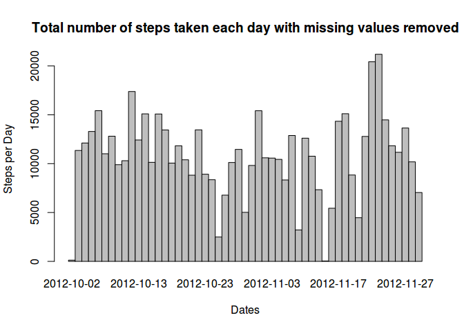
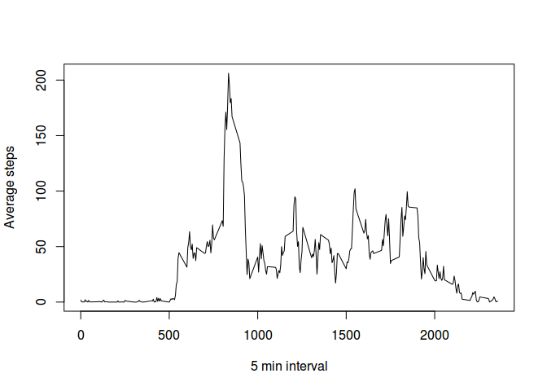
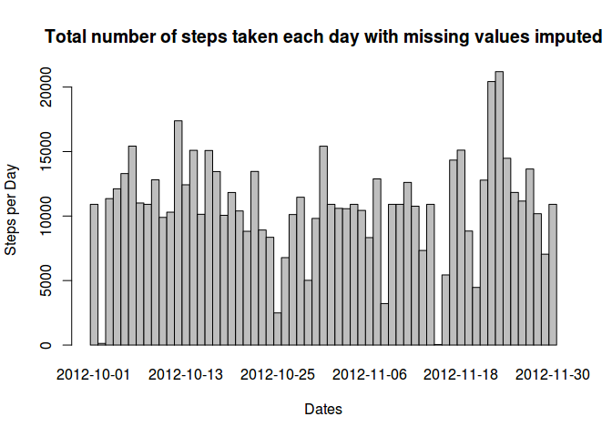
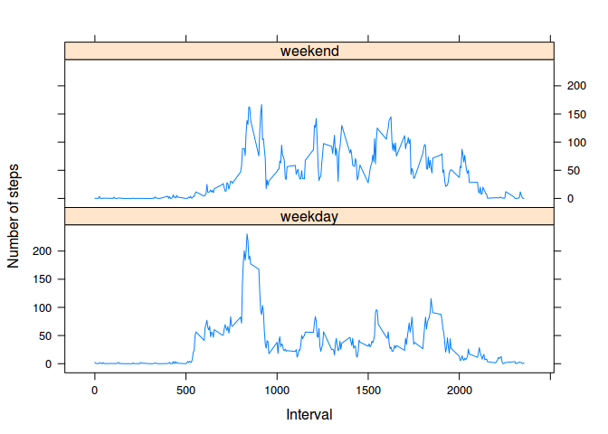

# Reproducible Research: Peer Assessment 1


## Loading and preprocessing the data

```r
givenData <- read.csv(unz("activity.zip","activity.csv"))
```

## What is mean total number of steps taken per day?

```r
dataNar <- na.omit(givenData)
##The total number of steps taken per day
df<- aggregate(steps ~ date, dataNar , function(x) sum(as.numeric(x)))
##plotting the histogram
##hist(df$steps,xlab="steps per day",main="Total number of steps taken each day", col="orange")  ##This doesn't show per day
with(df, {
       barplot(
        height=steps,
        main="Total number of steps taken each day with missing values removed",
        xlab="Dates",
        ylab="Steps per Day",
        names.arg=date,
        space=c(0)
    )
})
```

 

```r
meanVal <- mean(df$steps)
medianVal <- median(df$steps)
print(meanVal)
```

```
## [1] 10766.19
```

```r
print(medianVal)
```

```
## [1] 10765
```
The mean is 1.0766189\times 10^{4} and the median is 1.0765\times 10^{4} .


## What is the average daily activity pattern?

```r
##mean for steps for every five minute interval with data from removed values
dataStepsInterval <- aggregate(steps ~ interval,dataNar , function(x) mean(as.numeric(x)))
##Plotting average daily activity pattern
plot(dataStepsInterval$interval, dataStepsInterval$steps, type='l', xlab="5 min interval", ylab="Average steps")
```

 

```r
##Finding interval regarding maximum number of steps
interv<- dataStepsInterval[dataStepsInterval$steps == max(dataStepsInterval$steps),]
```
For the interval 835 to 840 on average across all the days in the dataset, contains the maximum number of steps.

## Imputing missing values

```r
##Total number of missing values in the dataset
missinVal <- nrow(givenData[is.na(givenData$steps)==TRUE,])
##Filling in missing values of the dataset
stepsData <- data.frame(givenData$steps)
stepsData[is.na(stepsData),] <- ceiling(tapply(X=givenData$steps,INDEX=givenData$interval,FUN=mean,na.rm=TRUE))
newData <- cbind(stepsData, givenData[,c("date","interval")])
colnames(newData) <- c("Steps", "Date", "Interval")
##The total number steps each day
dataStepsDate <- aggregate(Steps ~ Date,newData , function(x) sum(as.numeric(x)))
##Plotting the histogram
with(dataStepsDate, {
       barplot(
        height=Steps,
        main="Total number of steps taken each day with missing values imputed",
        xlab="Dates",
        ylab="Steps per Day",
        names.arg=Date,
        space=c(0)
    )
})
```

 

```r
##Calulating mean and median
newMeanVal <- mean(dataStepsDate$Steps)
newMedianVal <- median(dataStepsDate$Steps)
```
The total number of missing values in the dataset is 2304 .

The impact of imputing missing data on total daily number of steps:

* The mean changed from 1.0766189\times 10^{4} to 1.0784918\times 10^{4}

* The median changed from 1.0765\times 10^{4} to 1.0909\times 10^{4}

## Are there differences in activity patterns between weekdays and weekends?


```r
##Creating a new factor variable
day <- data.frame(sapply(X=newData$Date, FUN=function(d){
  if(weekdays(as.Date(d)) %in% c("Saturday","Sunday")){
    day<- "weekend"
  }
  else
    {
      day<-"weekday"
    }
}))

dataWithDay <- cbind(newData, day)
colnames(dataWithDay) <- c("Steps", "Date", "Interval", "Day")

##Plotting
dataStepsDay <- aggregate(Steps ~ Day + Interval, dataWithDay, FUN=mean)
library(lattice)
xyplot(
    type="l", data=dataStepsDay, Steps ~ Interval | Day, xlab="Interval", ylab="Number of steps", layout=c(1,2)
)
```

 


